# BIS15L Final Project Group 9

In this project, we are using data from the Open Access Series of Imaging Studies (OASIS), made available by the Washingtom UNiversity Alzheimer's Disease Research Center, Dr. Randy Buckner at the Howard Hughes Medical Institute (HHMI), the Neuroinformatics Research Group (NRG) at Washington University School of Medicine, and the Biomedical Informatics Research Network (BIRN). Our datasets were found on kaggle: [MRI and Alzheimer's Disease](https://www.kaggle.com/jboysen/mri-and-alzheimers).

The question we wanted to answer is "What are the differences in measured variables between Demented and Non-demented subjects and do they have any predictive value in the development of Alzheimer's Disease Dementia?"


Load libraries


```r
library(tidyverse)
```

```
## -- Attaching packages --------------------------------------- tidyverse 1.3.0 --
```

```
## v ggplot2 3.3.3     v purrr   0.3.4
## v tibble  3.1.0     v dplyr   1.0.4
## v tidyr   1.1.2     v stringr 1.4.0
## v readr   1.4.0     v forcats 0.5.1
```

```
## -- Conflicts ------------------------------------------ tidyverse_conflicts() --
## x dplyr::filter() masks stats::filter()
## x dplyr::lag()    masks stats::lag()
```

```r
library(RColorBrewer)
library(paletteer)
library(janitor)
```

```
## 
## Attaching package: 'janitor'
```

```
## The following objects are masked from 'package:stats':
## 
##     chisq.test, fisher.test
```

```r
library(here)
```

```
## here() starts at C:/Users/Sudev/Documents/GitHub/BISProject-Seona/BIS15L-Project
```

```r
library(GGally)
```

```
## Registered S3 method overwritten by 'GGally':
##   method from   
##   +.gg   ggplot2
```

```r
library(shiny)
library(shinydashboard)
```

```
## 
## Attaching package: 'shinydashboard'
```

```
## The following object is masked from 'package:graphics':
## 
##     box
```

```r
library(viridis)
```

```
## Loading required package: viridisLite
```


```r
options(scipen=999)
```


```r
longitudinal <- readr::read_csv("data/oasis_longitudinal.csv")
```

```
## 
## -- Column specification --------------------------------------------------------
## cols(
##   `Subject ID` = col_character(),
##   `MRI ID` = col_character(),
##   Group = col_character(),
##   Visit = col_double(),
##   `MR Delay` = col_double(),
##   `M/F` = col_character(),
##   Hand = col_character(),
##   Age = col_double(),
##   EDUC = col_double(),
##   SES = col_double(),
##   MMSE = col_double(),
##   CDR = col_double(),
##   eTIV = col_double(),
##   nWBV = col_double(),
##   ASF = col_double()
## )
```

```r
xsectional <- readr::read_csv("data/oasis_cross-sectional.csv")
```

```
## 
## -- Column specification --------------------------------------------------------
## cols(
##   ID = col_character(),
##   `M/F` = col_character(),
##   Hand = col_character(),
##   Age = col_double(),
##   Educ = col_double(),
##   SES = col_double(),
##   MMSE = col_double(),
##   CDR = col_double(),
##   eTIV = col_double(),
##   nWBV = col_double(),
##   ASF = col_double(),
##   Delay = col_character()
## )
```

**Let's take a look at the data: **


```r
glimpse(longitudinal)
```

```
## Rows: 373
## Columns: 15
## $ `Subject ID` <chr> "OAS2_0001", "OAS2_0001", "OAS2_0002", "OAS2_0002", "OAS2~
## $ `MRI ID`     <chr> "OAS2_0001_MR1", "OAS2_0001_MR2", "OAS2_0002_MR1", "OAS2_~
## $ Group        <chr> "Nondemented", "Nondemented", "Demented", "Demented", "De~
## $ Visit        <dbl> 1, 2, 1, 2, 3, 1, 2, 1, 2, 3, 1, 3, 4, 1, 2, 1, 2, 1, 2, ~
## $ `MR Delay`   <dbl> 0, 457, 0, 560, 1895, 0, 538, 0, 1010, 1603, 0, 518, 1281~
## $ `M/F`        <chr> "M", "M", "M", "M", "M", "F", "F", "M", "M", "M", "M", "M~
## $ Hand         <chr> "R", "R", "R", "R", "R", "R", "R", "R", "R", "R", "R", "R~
## $ Age          <dbl> 87, 88, 75, 76, 80, 88, 90, 80, 83, 85, 71, 73, 75, 93, 9~
## $ EDUC         <dbl> 14, 14, 12, 12, 12, 18, 18, 12, 12, 12, 16, 16, 16, 14, 1~
## $ SES          <dbl> 2, 2, NA, NA, NA, 3, 3, 4, 4, 4, NA, NA, NA, 2, 2, 2, 2, ~
## $ MMSE         <dbl> 27, 30, 23, 28, 22, 28, 27, 28, 29, 30, 28, 27, 27, 30, 2~
## $ CDR          <dbl> 0.0, 0.0, 0.5, 0.5, 0.5, 0.0, 0.0, 0.0, 0.5, 0.0, 0.5, 1.~
## $ eTIV         <dbl> 1987, 2004, 1678, 1738, 1698, 1215, 1200, 1689, 1701, 169~
## $ nWBV         <dbl> 0.696, 0.681, 0.736, 0.713, 0.701, 0.710, 0.718, 0.712, 0~
## $ ASF          <dbl> 0.883, 0.876, 1.046, 1.010, 1.034, 1.444, 1.462, 1.039, 1~
```

```r
summary(longitudinal)
```

```
##   Subject ID           MRI ID             Group               Visit      
##  Length:373         Length:373         Length:373         Min.   :1.000  
##  Class :character   Class :character   Class :character   1st Qu.:1.000  
##  Mode  :character   Mode  :character   Mode  :character   Median :2.000  
##                                                           Mean   :1.882  
##                                                           3rd Qu.:2.000  
##                                                           Max.   :5.000  
##                                                                          
##     MR Delay          M/F                Hand                Age       
##  Min.   :   0.0   Length:373         Length:373         Min.   :60.00  
##  1st Qu.:   0.0   Class :character   Class :character   1st Qu.:71.00  
##  Median : 552.0   Mode  :character   Mode  :character   Median :77.00  
##  Mean   : 595.1                                         Mean   :77.01  
##  3rd Qu.: 873.0                                         3rd Qu.:82.00  
##  Max.   :2639.0                                         Max.   :98.00  
##                                                                        
##       EDUC           SES            MMSE            CDR              eTIV     
##  Min.   : 6.0   Min.   :1.00   Min.   : 4.00   Min.   :0.0000   Min.   :1106  
##  1st Qu.:12.0   1st Qu.:2.00   1st Qu.:27.00   1st Qu.:0.0000   1st Qu.:1357  
##  Median :15.0   Median :2.00   Median :29.00   Median :0.0000   Median :1470  
##  Mean   :14.6   Mean   :2.46   Mean   :27.34   Mean   :0.2909   Mean   :1488  
##  3rd Qu.:16.0   3rd Qu.:3.00   3rd Qu.:30.00   3rd Qu.:0.5000   3rd Qu.:1597  
##  Max.   :23.0   Max.   :5.00   Max.   :30.00   Max.   :2.0000   Max.   :2004  
##                 NA's   :19     NA's   :2                                      
##       nWBV             ASF       
##  Min.   :0.6440   Min.   :0.876  
##  1st Qu.:0.7000   1st Qu.:1.099  
##  Median :0.7290   Median :1.194  
##  Mean   :0.7296   Mean   :1.195  
##  3rd Qu.:0.7560   3rd Qu.:1.293  
##  Max.   :0.8370   Max.   :1.587  
## 
```


```r
glimpse(xsectional)
```

```
## Rows: 436
## Columns: 12
## $ ID    <chr> "OAS1_0001_MR1", "OAS1_0002_MR1", "OAS1_0003_MR1", "OAS1_0004_MR~
## $ `M/F` <chr> "F", "F", "F", "M", "M", "F", "M", "F", "M", "F", "M", "F", "F",~
## $ Hand  <chr> "R", "R", "R", "R", "R", "R", "R", "R", "R", "R", "R", "R", "R",~
## $ Age   <dbl> 74, 55, 73, 28, 18, 24, 21, 20, 74, 52, 30, 81, 19, 76, 82, 21, ~
## $ Educ  <dbl> 2, 4, 4, NA, NA, NA, NA, NA, 5, 3, NA, 5, NA, 2, 2, NA, 3, 5, 5,~
## $ SES   <dbl> 3, 1, 3, NA, NA, NA, NA, NA, 2, 2, NA, 2, NA, NA, 4, NA, 4, 1, 2~
## $ MMSE  <dbl> 29, 29, 27, NA, NA, NA, NA, NA, 30, 30, NA, 30, NA, 28, 27, NA, ~
## $ CDR   <dbl> 0.0, 0.0, 0.5, NA, NA, NA, NA, NA, 0.0, 0.0, NA, 0.0, NA, 0.5, 0~
## $ eTIV  <dbl> 1344, 1147, 1454, 1588, 1737, 1131, 1516, 1505, 1636, 1321, 1574~
## $ nWBV  <dbl> 0.743, 0.810, 0.708, 0.803, 0.848, 0.862, 0.830, 0.843, 0.689, 0~
## $ ASF   <dbl> 1.306, 1.531, 1.207, 1.105, 1.010, 1.551, 1.157, 1.166, 1.073, 1~
## $ Delay <chr> "N/A", "N/A", "N/A", "N/A", "N/A", "N/A", "N/A", "N/A", "N/A", "~
```

```r
summary(xsectional)
```

```
##       ID                M/F                Hand                Age       
##  Length:436         Length:436         Length:436         Min.   :18.00  
##  Class :character   Class :character   Class :character   1st Qu.:23.00  
##  Mode  :character   Mode  :character   Mode  :character   Median :54.00  
##                                                           Mean   :51.36  
##                                                           3rd Qu.:74.00  
##                                                           Max.   :96.00  
##                                                                          
##       Educ            SES             MMSE            CDR        
##  Min.   :1.000   Min.   :1.000   Min.   :14.00   Min.   :0.0000  
##  1st Qu.:2.000   1st Qu.:2.000   1st Qu.:26.00   1st Qu.:0.0000  
##  Median :3.000   Median :2.000   Median :29.00   Median :0.0000  
##  Mean   :3.179   Mean   :2.491   Mean   :27.06   Mean   :0.2851  
##  3rd Qu.:4.000   3rd Qu.:3.000   3rd Qu.:30.00   3rd Qu.:0.5000  
##  Max.   :5.000   Max.   :5.000   Max.   :30.00   Max.   :2.0000  
##  NA's   :201     NA's   :220     NA's   :201     NA's   :201     
##       eTIV           nWBV             ASF           Delay          
##  Min.   :1123   Min.   :0.6440   Min.   :0.881   Length:436        
##  1st Qu.:1368   1st Qu.:0.7428   1st Qu.:1.112   Class :character  
##  Median :1476   Median :0.8090   Median :1.190   Mode  :character  
##  Mean   :1482   Mean   :0.7917   Mean   :1.199                     
##  3rd Qu.:1579   3rd Qu.:0.8420   3rd Qu.:1.284                     
##  Max.   :1992   Max.   :0.8930   Max.   :1.563                     
## 
```

Clean Names


```r
longitudinal <- janitor::clean_names(longitudinal)
xsectional <- janitor::clean_names(xsectional)
```


```r
names(longitudinal)
```

```
##  [1] "subject_id" "mri_id"     "group"      "visit"      "mr_delay"  
##  [6] "m_f"        "hand"       "age"        "educ"       "ses"       
## [11] "mmse"       "cdr"        "e_tiv"      "n_wbv"      "asf"
```

```r
names(xsectional)
```

```
##  [1] "id"    "m_f"   "hand"  "age"   "educ"  "ses"   "mmse"  "cdr"   "e_tiv"
## [10] "n_wbv" "asf"   "delay"
```
# Explanation of Datasets

The **Longitudinal Dataset** includes data from 150 patients, aged 60-96 years old. Each subject received an MRI scan on two or more visits, separated by at least one year for a total of 373 imaging sessions. In this dataset, 72 patients were characterized as Nondemented, 64 were characterized as demented (with 51 subjects having mild to moderate dementia), and 14 were converted throughout the study.

The **Cross Sectional Dataset** includes data from 416 subjects aged 18 to 96 years old. In this dataset, 100 subjects over the age of 60 were clinically diagnosed with very mild to moderate Alzheimer’s disease, and 20 nondemented subjects were used as a control in the study.


# Explanation of Variables
**CDR** - Clinical Dementia Rating - Used to group patients based on the severity of dementia (0 = no dementia, 0.5 = very mild AD, 1 = mild AD, 2 = moderate AD)

**eTIV** - Estimated Total Intracranial Volume 

**nWBV** - Normalized Whole Brain Volume - as measured by mRI

**ASF** - Atlas Scaling Factor - factor that allows for comparison of estimated total intracranial volume based on differences in human anatomy

**MR Delay** - Time between appointments

**Group** - demented/nondemented/converted (Coverted means that they did not have dementia at their first visit to the doctor, but was diagnosed with dementia at a subsequent visit during the study).

**Hand** - All patients are right handed

**Age** - Age in years 

**EDUC** - Education Status (measured in years)

**SES** - socioeconomic status as measured by the Hollingshead Index of Social Position, where 1 = highest status and 5 = lowest status


# Cursory Analysis of the data: 


### Age Distribution Plots of Both Datasets

```r
xsectional %>% 
  ggplot(aes(x=age, fill= as.factor(age), alpha= 0.5))+
  geom_bar()+
  labs(title="Cross-Sectional Age Distribution",
       x="Age",
       y="Count")+
  scale_fill_viridis(option = "C", discrete = TRUE)+
  theme_classic()+
  theme(axis.text.x = element_text(angle = 60, hjust = 1, size = 7, ), plot.title = element_text(hjust = .5), legend.position = "none")
```

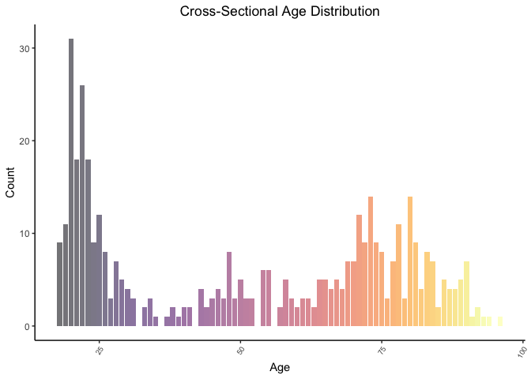<!-- -->

```r
longitudinal %>% 
  group_by("subject_id") %>% 
  ggplot(aes(x=age, fill= as.factor(age), alpha = 0.5))+
  geom_bar()+
  labs(title="Longitudinal Age Distribution",
       x="Age",
       y="Count")+
  scale_fill_viridis(option = "D", discrete = TRUE)+
  theme_classic()+
  theme(axis.text.x = element_text(angle = 60, hjust = 1, size = 8), plot.title = element_text(hjust = .5),legend.position = "none")
```

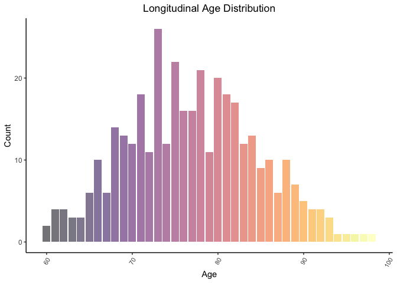<!-- -->

### Socioeconomic Status Distribution Plots of Both Datasets


```r
xsectional %>% 
  ggplot(aes(x=ses, fill=as.factor(ses), alpha = 0.7))+
  geom_bar()+
  labs(title="Cross-Sectional Socioeconomic Status Distribution",
       x="Socioeconomic Status",
       y="Count")+
  theme_classic()+
  scale_fill_viridis(option = "C", discrete = TRUE)+
  theme(plot.title = element_text(hjust = .5), legend.position = "none")
```

```
## Warning: Removed 220 rows containing non-finite values (stat_count).
```

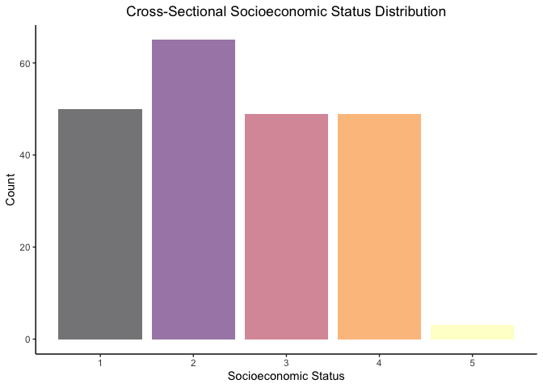<!-- -->

```r
longitudinal %>% 
  group_by("subject_id") %>% 
  filter(ses != "NA") %>% 
  ggplot(aes(x=as.factor(ses), fill=as.factor(ses), alpha = 0.7))+
  geom_bar()+
  labs(title="Longitudinal Socioeconomic Status Distribution",
       x="Socioeconomic Status",
       y="Count")+
  theme_classic()+
  scale_fill_viridis(option = "D", discrete = TRUE)+
  theme(plot.title = element_text(hjust = .5), legend.position = "none")
```

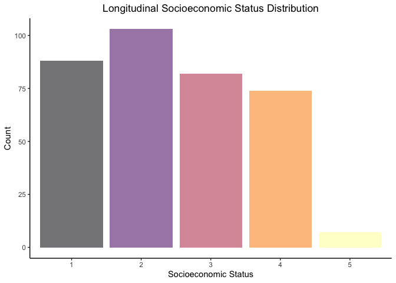<!-- -->


### Sex Distribution Plots of Both Datasets


```r
xsectional %>%
  ggplot(aes(x=m_f, fill = m_f, alpha = 0.5))+
  geom_bar()+
  labs(title="Cross-Sectional Sex Distribution",
       x="Sex",
       y="Count")+
  theme_classic()+
  scale_fill_viridis(option = "C", discrete = TRUE)+
  theme(plot.title = element_text(hjust = .5), legend.position = "none")
```

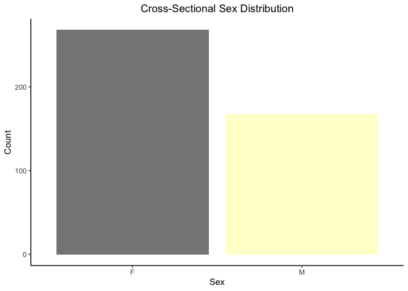<!-- -->

```r
longitudinal %>% 
  group_by("subject_id") %>% 
  ggplot(aes(x=m_f, fill = m_f, alpha = 0.5))+
  geom_bar()+
  labs(title="Longitudinal Sex Distribution",
       x="Sex",
       y="Count")+
  theme_classic()+
  scale_fill_viridis(option = "D", discrete = TRUE)+
  theme(plot.title = element_text(hjust = .5), legend.position = "none")
```

<!-- -->

### Education Status Distribution Plots of Both Datasets


```r
xsectional %>% 
  ggplot(aes(x=educ, fill = as.factor(educ), alpha = 0.5))+
  geom_bar()+
   labs(title="Cross-Sectional Education Status Distribution",
       x="Education Status",
       y="Count")+
  theme_classic()+
  scale_fill_viridis(option = "C", discrete = TRUE)+
  theme(plot.title = element_text(hjust = .5), legend.position = "none")
```

```
## Warning: Removed 201 rows containing non-finite values (stat_count).
```

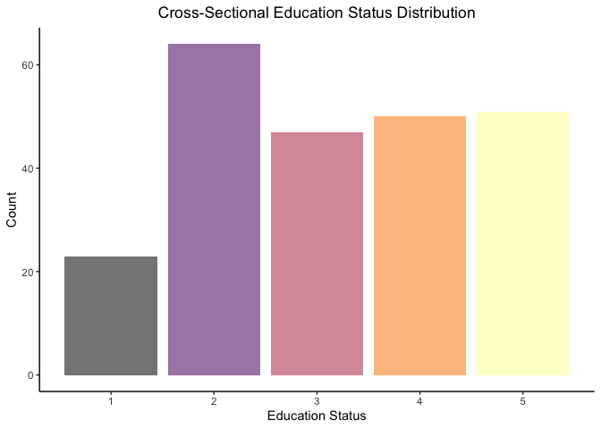<!-- -->

```r
longitudinal %>% 
  group_by("subject_id") %>% 
  ggplot(aes(x=educ, fill = as.factor(educ), alpha=0.5))+
  geom_bar()+
   labs(title="Longitudinal Education Status Distribution",
       x="Education Status",
       y="Count")+
  theme_classic()+
  scale_fill_viridis(option = "D", discrete = TRUE)+
  theme(plot.title = element_text(hjust = .5), legend.position = "none")
```

<!-- -->

### Group Distribution Plot of Longitudinal Dataset


```r
longitudinal %>% 
  group_by("subject_id") %>% 
  ggplot(aes(x=group, fill = group, alpha=0.5))+
  geom_bar()+
   labs(title="Longitudinal Dementia Status Distribution",
       x=NULL,
       y="Count")+
  theme_classic()+
  scale_fill_viridis(option = "D", discrete = TRUE)+
  theme(plot.title = element_text(hjust = .5), legend.position = "none")
```

<!-- -->

### Correlation Plots of Both Datasets


```r
ggcorr(longitudinal, label = TRUE, label_size = 3, size = 4, hjust = 0.75)+
  labs(title="Longitudinal Correlation Plot")+
  theme(plot.title = element_text(hjust = 0.5))
```

```
## Warning in ggcorr(longitudinal, label = TRUE, label_size = 3, size = 4, : data
## in column(s) 'subject_id', 'mri_id', 'group', 'm_f', 'hand' are not numeric and
## were ignored
```

<!-- -->

```r
ggcorr(xsectional, label = TRUE, label_size = 3)+
  labs(title="Cross-Sectional Correlation Plot")+
  theme(plot.title = element_text(hjust = .5))
```

```
## Warning in ggcorr(xsectional, label = TRUE, label_size = 3): data in column(s)
## 'id', 'm_f', 'hand', 'delay' are not numeric and were ignored
```

<!-- -->

### How does normalized whole brain volume and CDR change with age?


```r
n_wbv_xsectional <- xsectional %>% 
  filter(age!='NA' | n_wbv!='NA') %>% 
  ggplot(aes(x=age, y=n_wbv, color = cdr))+
  scale_color_viridis(option = "B")+
  geom_smooth(method = "lm")+
  geom_point()+
  theme_classic()+
  theme(axis.text.x = element_text(angle = 60, hjust = 1, size = 8), plot.title = element_text(size = rel(1), hjust = 0.5))+
  labs(title = "Distribution of Normalized Whole Brain Volume", x= "Age", y="Normalized Whole Brain Volume")
n_wbv_xsectional
```

```
## `geom_smooth()` using formula 'y ~ x'
```

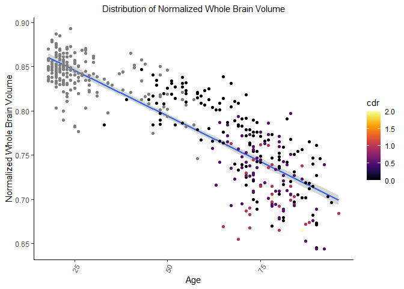<!-- -->

### What is the relationship between CDR and Normalized Whole Brain Volume?


```r
xsectional %>% ##comparison of n_wbv between demented patients and age matched controls
  group_by(as.factor(cdr)) %>% 
  ggplot(aes(x=as.factor(cdr),y=n_wbv,group=as.factor(cdr),color=as.factor(cdr),fill=as.factor(cdr),alpha=.5))+
  geom_boxplot()+
  geom_jitter()+#Could Exclude
  theme_classic()+
  theme(plot.title = element_text(hjust = .5),legend.position = "none")+
  labs(title=" Normalized Whole Brain Volume vs Clinical Dementia Rating",
       x="Clinical Dementia Rating",
       y="Normalized Whole Brain Volume")+
  scale_x_discrete(labels=c("NA" = "Young"))
```

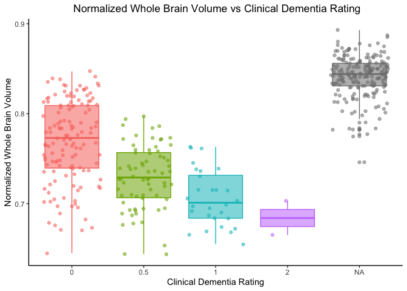<!-- -->

### What is the Distribution of Age within CDR groups?


```r
xsectional %>% #Violin comparison of Demented vs Nondemented and age
  filter(cdr!="NA", age>60) %>% 
  ggplot(aes(x = as.factor(cdr), y = age, group=cdr,color=as.factor(cdr))) + 
  geom_violin(aes(fill = as.factor(cdr),alpha=.5)) + 
  geom_boxplot(width = 0.2, alpha=1)+
  theme_classic()+
  labs(title="Age Distribution Between Groups",
       x="CDR",
       y="Age Distribution ")+
  theme(plot.title = element_text(hjust = .5),legend.position = "none")
```

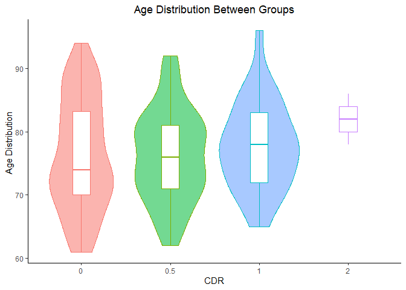<!-- -->

### Years of Education Between Groups


```r
longitudinal %>% #Comparison of education between demented participants and age matched controls
  filter(age>60,group!="Converted",visit==1) %>% 
  group_by(group) %>% 
  ggplot(aes(x=group,y=educ,fill=group,color=group,alpha=.5))+
  geom_boxplot()+
  theme_classic()+
  labs(title="Years of Education vs Dementia Status",
       x=NULL,
       y="Education")+
  theme(plot.title = element_text(hjust = .5),legend.position = "none")+
  scale_x_discrete(labels=c("Nondemented" = "Non-Demented"))
```

<!-- -->

### SES Distribution Between Groups


```r
longitudinal %>% #Comparison of ses between demented participants and age matched controls
  filter(age>60,group!="Converted",ses!="NA",visit==1) %>% 
  group_by(group) %>% 
  ggplot(aes(x=group,y=ses,fill=group,color=group,alpha=.5))+
  geom_boxplot()+
  labs(title="SES vs Dementia Status",
       x=NULL,
       y="SES")+
  theme_classic()+
  theme(plot.title = element_text(hjust = .5),legend.position = "none")+
  scale_x_discrete(labels=c("Nondemented" = "Non-Demented"))
```

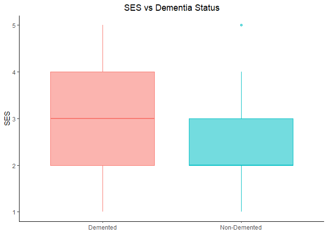<!-- -->

### How does normalized whole brain volume change over subsequent visits?


```r
longitudinal %>% #Comparison of MMSE and CDR
  filter(visit==1 | visit==2,mmse!="NA") %>% 
  mutate(cdr = as.factor(cdr)) %>%
  ggplot(aes(cdr, mmse, fill = cdr,color=cdr))+
  geom_boxplot(alpha = 0.5) +
  geom_jitter(aes(color = cdr),alpha = 0.7)+
  theme_classic()+
  labs(title= "Mini-Mental State Examination",
       x="Clinical Dementia Rating",
       y="Mini-Mental State Examination")+
  theme(plot.title = element_text(hjust = .5),legend.position = "none")
```

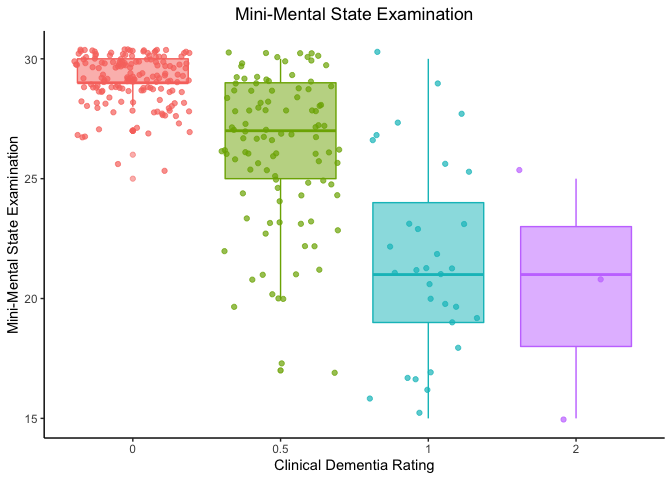<!-- -->

```r
longitudinal %>% #Observing the change between visits in n_wbv of the Nondemented group
  filter(group=="Nondemented") %>% 
  ggplot(aes(x=visit,y=n_wbv,color=subject_id))+ 
  geom_point()+
  geom_line()+
  theme_classic()+
  labs(title="Change in Normalized Whole Brain Volume Over Time (Non-Demented|CDR=0)",
       x="Visit Number",
       y="Normalized Whole Brain Volume")+
  theme(plot.title = element_text(hjust = .5),legend.position = "none")
```

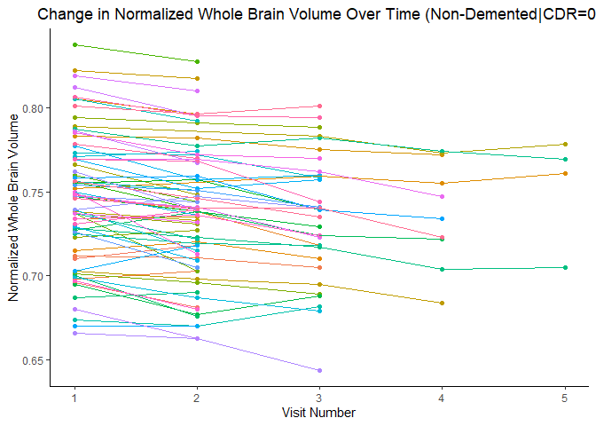<!-- -->

```r
longitudinal %>% #Observing the change between visits in n_wbv of the Demented group
  filter(group=="Demented") %>% 
  ggplot(aes(x=visit,y=n_wbv,color=subject_id))+ 
  geom_point()+
  geom_line()+
  theme_classic()+
  labs(title="Change in Normalized Whole Brain Volume Over Time (Demented|CDR>0)",
       x="Visit Number",
       y="Normalized Whole Brain Volume")+
  theme(plot.title = element_text(hjust = .5),legend.position = "none")
```

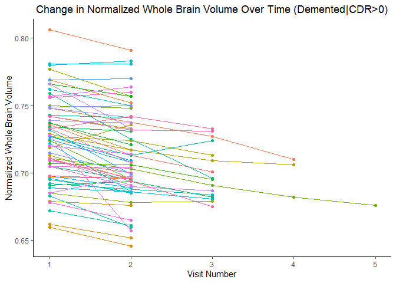<!-- -->

```r
longitudinal %>% #Observing the change between visits in n_wbv of the converted group
  filter(group=="Converted") %>% 
  ggplot(aes(x=visit,y=n_wbv,color=subject_id))+ 
  geom_point()+
  geom_line()+
  theme_classic()+
  labs(title="Change in Normalized Whole Brain Volume Over Time (Converted)",
       x="Visit Number",
       y="Normalized Whole Brain Volume")+
  theme(plot.title = element_text(hjust = .5),legend.position = "none")
```

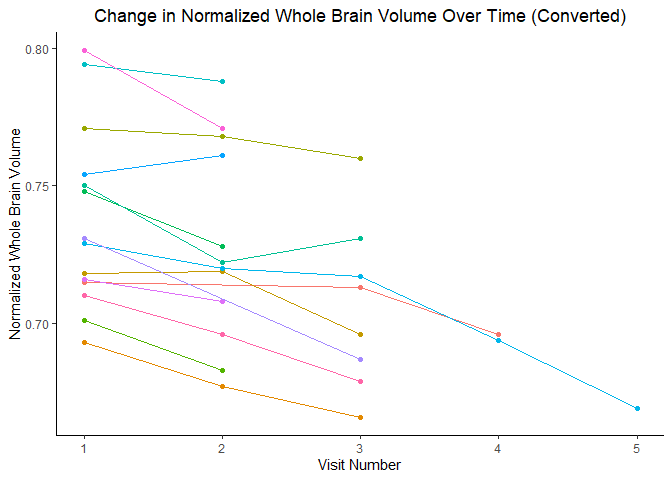<!-- -->

```r
longitudinal %>% #Observing the change between visits in n_wbv of the Nondemented group with trend line
  filter(group=="Nondemented") %>% 
  ggplot(aes(x=visit,y=n_wbv,group=group,color=subject_id))+ 
  geom_point()+
  geom_smooth(method="lm",se=TRUE)+
  theme_classic()+
  labs(title="Change in Normalized Whole Brain Volume Over Time (Nondemented)",
       x="Visit Number",
       y="Normalized Whole Brain Volume")+
  theme(plot.title = element_text(hjust = .5),legend.position = "none")
```

```
## `geom_smooth()` using formula 'y ~ x'
```

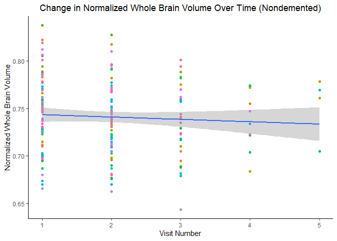<!-- -->

```r
longitudinal %>% #Observing the change between visits in n_wbv of the Demented  group with trand line
  filter(group=="Demented") %>% 
  ggplot(aes(x=visit,y=n_wbv,group=group,color=subject_id))+ 
  geom_point()+
  geom_smooth(method=lm,se=TRUE,fullrange=TRUE)+
  theme_classic()+
  labs(title="Change in Normalized Whole Brain Volume Over Time (Demented)",
       x="Visit Number",
       y="Normalized Whole Brain Volume")+
  theme(plot.title = element_text(hjust = .5),legend.position = "none")
```

```
## `geom_smooth()` using formula 'y ~ x'
```

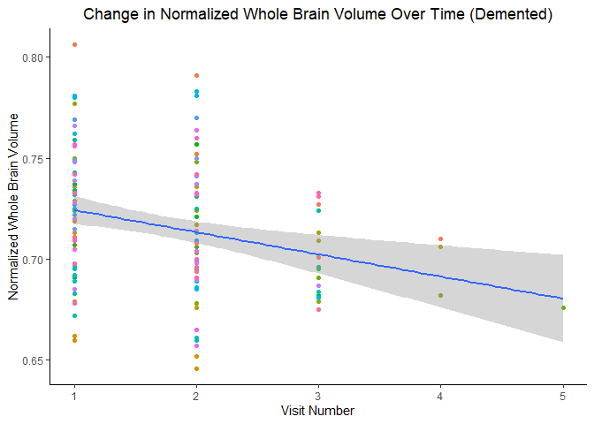<!-- -->

```r
longitudinal %>% #Observing the change between visits in n_wbv of the converted group with trend line and standard error
  filter(group=="Converted") %>% 
  ggplot(aes(x=visit,y=n_wbv,group=group,color=subject_id))+ 
  geom_point()+
  geom_smooth(method=lm,se=TRUE,fullrange=TRUE)+
  theme_classic()+
  labs(title="Change in Normalized Whole Brain Volume Over Time (Converted)",
       x="Visit Number",
       y="Normalized Whole Brain Volume")+
  theme(plot.title = element_text(hjust = .5),legend.position = "none")
```

```
## `geom_smooth()` using formula 'y ~ x'
```

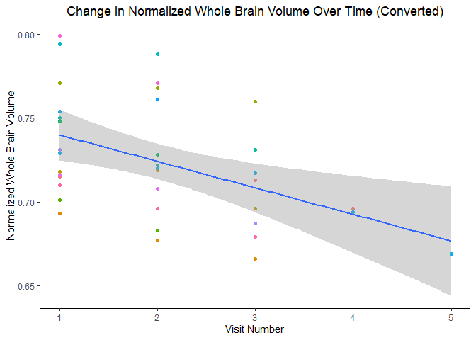<!-- -->


App made for our project, looks at the proportion of patients that are converted and demented given a range of values for range and normalized whole brain volume


```r
ui <- dashboardPage(skin = "red", 
                    dashboardHeader(title = "Predictors of Alzheimer's Disease from first visit", 
                                    titleWidth = 300), 
                    dashboardSidebar(disable=T), 
                    dashboardBody(
  fluidPage(
  selectInput("nWBVMin", "Lower bound of normalized brain volume on first visit", choices=c("0.6","0.72","0.74","0.76","0.78","0.8","0.82")),
  selectInput("nWBVMax", "Upper bound of normalized brain volume on first visit",    choices=c("0.7","0.72","0.74","0.76","0.78","0.8","0.82","0.84")),
  selectInput("AgeMin", "Lower bound of Age", choices = c("60", "70", "80")),
  selectInput("AgeMax", "Upper bound of Age", choices = c("60", "70", "80", "90")),
  
  textOutput("result"),
  
  plotOutput("plot", width = "500px", height = "400px")
  
)
)
)

server <- function(input, output, session) {
  
  totalDemented <- longitudinal %>%
    filter(group=='Demented') %>%
    nrow()
  
  totalConverted <- longitudinal %>%
    filter(group=='Converted') %>%
    nrow()
  #This gets the number of patients who fit the criteria
  numpatients <-  reactive({longitudinal %>%
      filter(visit==1) %>%
      filter(n_wbv>=input$nWBVMin & n_wbv<= input$nWBVMax) %>%
      filter(age>=input$AgeMin & age<= input$AgeMax)%>%
      nrow()
  })
  
  #This gets the number of patients who fit the criteria and are converted
  numconverted <-  reactive({longitudinal %>%
      filter(visit==1) %>%
      filter(n_wbv>=input$nWBVMin & n_wbv<= input$nWBVMax) %>%
      filter(age>=input$AgeMin & age<= input$AgeMax) %>%
      filter(group == 'Converted') %>%
      nrow()
  })
  
  #This gets the number of patients who fit the criteria and are demented
  numdemented <-  reactive({longitudinal %>%
      filter(visit==1) %>%
      filter(n_wbv>=input$nWBVMin & n_wbv<= input$nWBVMax) %>%
      filter(age>=input$AgeMin & age<= input$AgeMax) %>%
      filter(group == 'Demented') %>%
      nrow()
  })
  
  #Prints out the output
  output$result <- renderText({
    c(numpatients(),"PATIENTS MEET LISTED SEARCH CRITERIA: ", numdemented(), "of the 64 patients with existing dementia had brain volumes and ages within these values. ", numconverted(), "of the 14 who did not have dementia but later converted to dementia had brain volumes and ages within these values.")
  
    
    
    })
  
  output$plot <- renderPlot({
    longitudinal%>%
    filter(visit==1) %>%
    filter(n_wbv>=input$nWBVMin & n_wbv<= input$nWBVMax) %>%
    filter(age>=input$AgeMin & age<= input$AgeMax) %>%
    filter(group != 'Nondemented') %>%
    ggplot(aes(x = group)) + geom_bar(fill = 'red', alpha = 0.65) + ylim(0, 75) + geom_text(stat='count', aes(label=..count..), vjust=-1) + labs(x = 'Group', y = 'Count') 
    
  })
  
  # stop the app when closed
  session$onSessionEnded(stopApp)
}


shinyApp(ui, server)
```

`<div style="width: 100% ; height: 400px ; text-align: center; box-sizing: border-box; -moz-box-sizing: border-box; -webkit-box-sizing: border-box;" class="muted well">Shiny applications not supported in static R Markdown documents</div>`{=html}

### Conclusions

There are differences in several key variables such as Socioeconomic Status, Normalized Whole Brain Volume, and Average Educational Attainment between Demented and Non-Demented Patient Groups. Furthermore, We found that converted patients had a similar rate of decline in Normalized Whole Brain Volume  to Demented Patients, suggesting the possible predictive value of rate of change of Normalized Whole Brain values over time.


