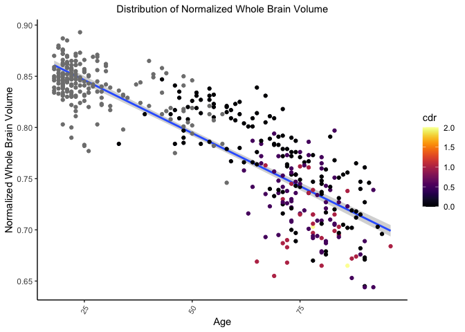
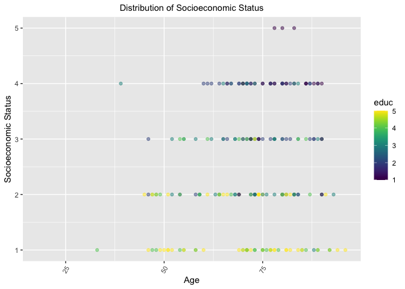
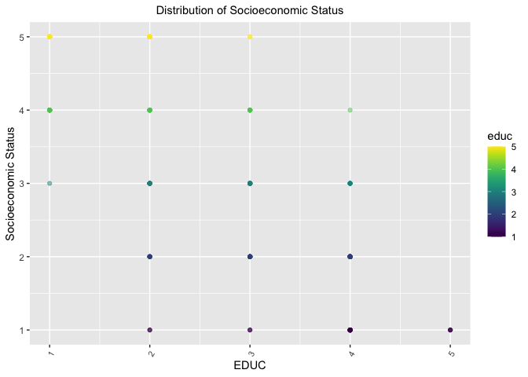
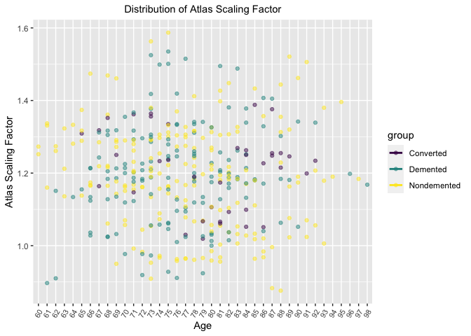

##MRI Data and Alzhiemer's Disease

In this project, we are using data from the Open Access Series of Imaging Studies (OASIS), made available by the Washingtom UNiversity Alzheimer's Disease Research Center, Dr. Randy Buckner at the Howard Hughes Medical Institute (HHMI), the Neuroinformatics Research Group (NRG) at Washington University School of Medicine, and the Biomedical Informatics Research Network (BIRN). [MRI and Alzheimer's Disease](https://www.kaggle.com/jboysen/mri-and-alzheimers)

Load libraries

```r
library(tidyverse)
```

```
## ── Attaching packages ─────────────────────────────────────── tidyverse 1.3.0 ──
```

```
## ✓ ggplot2 3.3.3     ✓ purrr   0.3.4
## ✓ tibble  3.1.0     ✓ dplyr   1.0.4
## ✓ tidyr   1.1.2     ✓ stringr 1.4.0
## ✓ readr   1.4.0     ✓ forcats 0.5.1
```

```
## ── Conflicts ────────────────────────────────────────── tidyverse_conflicts() ──
## x dplyr::filter() masks stats::filter()
## x dplyr::lag()    masks stats::lag()
```

```r
library(RColorBrewer)
library(paletteer)
library(janitor)
```

```
## 
## Attaching package: 'janitor'
```

```
## The following objects are masked from 'package:stats':
## 
##     chisq.test, fisher.test
```

```r
library(here)
```

```
## here() starts at /Users/seonapatel/Desktop/GitHub/BIS15L-Project
```

```r
library("RColorBrewer")
library("paletteer")
library(viridis)
```

```
## Loading required package: viridisLite
```

```r
library(GGally)
```

```
## Registered S3 method overwritten by 'GGally':
##   method from   
##   +.gg   ggplot2
```


```r
options(scipen=999)
```


```r
longitudinal <- readr::read_csv("data/oasis_longitudinal.csv")
```

```
## 
## ── Column specification ────────────────────────────────────────────────────────
## cols(
##   `Subject ID` = col_character(),
##   `MRI ID` = col_character(),
##   Group = col_character(),
##   Visit = col_double(),
##   `MR Delay` = col_double(),
##   `M/F` = col_character(),
##   Hand = col_character(),
##   Age = col_double(),
##   EDUC = col_double(),
##   SES = col_double(),
##   MMSE = col_double(),
##   CDR = col_double(),
##   eTIV = col_double(),
##   nWBV = col_double(),
##   ASF = col_double()
## )
```

```r
xsectional <- readr::read_csv("data/oasis_cross-sectional.csv")
```

```
## 
## ── Column specification ────────────────────────────────────────────────────────
## cols(
##   ID = col_character(),
##   `M/F` = col_character(),
##   Hand = col_character(),
##   Age = col_double(),
##   Educ = col_double(),
##   SES = col_double(),
##   MMSE = col_double(),
##   CDR = col_double(),
##   eTIV = col_double(),
##   nWBV = col_double(),
##   ASF = col_double(),
##   Delay = col_character()
## )
```

```r
glimpse(longitudinal)
```

```
## Rows: 373
## Columns: 15
## $ `Subject ID` <chr> "OAS2_0001", "OAS2_0001", "OAS2_0002", "OAS2_0002", "OAS2…
## $ `MRI ID`     <chr> "OAS2_0001_MR1", "OAS2_0001_MR2", "OAS2_0002_MR1", "OAS2_…
## $ Group        <chr> "Nondemented", "Nondemented", "Demented", "Demented", "De…
## $ Visit        <dbl> 1, 2, 1, 2, 3, 1, 2, 1, 2, 3, 1, 3, 4, 1, 2, 1, 2, 1, 2, …
## $ `MR Delay`   <dbl> 0, 457, 0, 560, 1895, 0, 538, 0, 1010, 1603, 0, 518, 1281…
## $ `M/F`        <chr> "M", "M", "M", "M", "M", "F", "F", "M", "M", "M", "M", "M…
## $ Hand         <chr> "R", "R", "R", "R", "R", "R", "R", "R", "R", "R", "R", "R…
## $ Age          <dbl> 87, 88, 75, 76, 80, 88, 90, 80, 83, 85, 71, 73, 75, 93, 9…
## $ EDUC         <dbl> 14, 14, 12, 12, 12, 18, 18, 12, 12, 12, 16, 16, 16, 14, 1…
## $ SES          <dbl> 2, 2, NA, NA, NA, 3, 3, 4, 4, 4, NA, NA, NA, 2, 2, 2, 2, …
## $ MMSE         <dbl> 27, 30, 23, 28, 22, 28, 27, 28, 29, 30, 28, 27, 27, 30, 2…
## $ CDR          <dbl> 0.0, 0.0, 0.5, 0.5, 0.5, 0.0, 0.0, 0.0, 0.5, 0.0, 0.5, 1.…
## $ eTIV         <dbl> 1987, 2004, 1678, 1738, 1698, 1215, 1200, 1689, 1701, 169…
## $ nWBV         <dbl> 0.696, 0.681, 0.736, 0.713, 0.701, 0.710, 0.718, 0.712, 0…
## $ ASF          <dbl> 0.883, 0.876, 1.046, 1.010, 1.034, 1.444, 1.462, 1.039, 1…
```


```r
summary(longitudinal)
```

```
##   Subject ID           MRI ID             Group               Visit      
##  Length:373         Length:373         Length:373         Min.   :1.000  
##  Class :character   Class :character   Class :character   1st Qu.:1.000  
##  Mode  :character   Mode  :character   Mode  :character   Median :2.000  
##                                                           Mean   :1.882  
##                                                           3rd Qu.:2.000  
##                                                           Max.   :5.000  
##                                                                          
##     MR Delay          M/F                Hand                Age       
##  Min.   :   0.0   Length:373         Length:373         Min.   :60.00  
##  1st Qu.:   0.0   Class :character   Class :character   1st Qu.:71.00  
##  Median : 552.0   Mode  :character   Mode  :character   Median :77.00  
##  Mean   : 595.1                                         Mean   :77.01  
##  3rd Qu.: 873.0                                         3rd Qu.:82.00  
##  Max.   :2639.0                                         Max.   :98.00  
##                                                                        
##       EDUC           SES            MMSE            CDR              eTIV     
##  Min.   : 6.0   Min.   :1.00   Min.   : 4.00   Min.   :0.0000   Min.   :1106  
##  1st Qu.:12.0   1st Qu.:2.00   1st Qu.:27.00   1st Qu.:0.0000   1st Qu.:1357  
##  Median :15.0   Median :2.00   Median :29.00   Median :0.0000   Median :1470  
##  Mean   :14.6   Mean   :2.46   Mean   :27.34   Mean   :0.2909   Mean   :1488  
##  3rd Qu.:16.0   3rd Qu.:3.00   3rd Qu.:30.00   3rd Qu.:0.5000   3rd Qu.:1597  
##  Max.   :23.0   Max.   :5.00   Max.   :30.00   Max.   :2.0000   Max.   :2004  
##                 NA's   :19     NA's   :2                                      
##       nWBV             ASF       
##  Min.   :0.6440   Min.   :0.876  
##  1st Qu.:0.7000   1st Qu.:1.099  
##  Median :0.7290   Median :1.194  
##  Mean   :0.7296   Mean   :1.195  
##  3rd Qu.:0.7560   3rd Qu.:1.293  
##  Max.   :0.8370   Max.   :1.587  
## 
```

```r
longitudinal <- janitor::clean_names(longitudinal)
xsectional <- janitor::clean_names(xsectional)
```


```r
names(longitudinal)
```

```
##  [1] "subject_id" "mri_id"     "group"      "visit"      "mr_delay"  
##  [6] "m_f"        "hand"       "age"        "educ"       "ses"       
## [11] "mmse"       "cdr"        "e_tiv"      "n_wbv"      "asf"
```

```r
names(xsectional)
```

```
##  [1] "id"    "m_f"   "hand"  "age"   "educ"  "ses"   "mmse"  "cdr"   "e_tiv"
## [10] "n_wbv" "asf"   "delay"
```

```r
longitudinal$age <- as.factor(longitudinal$age)
```


```r
longitudinal %>% 
  ggplot(aes(x=age, y=n_wbv, fill=m_f))+
  geom_col()
```

<!-- -->


```r
longitudinal %>% 
  ggplot(aes(x=educ))+geom_bar()
```

<!-- -->

```r
names(longitudinal)
```

```
##  [1] "subject_id" "mri_id"     "group"      "visit"      "mr_delay"  
##  [6] "m_f"        "hand"       "age"        "educ"       "ses"       
## [11] "mmse"       "cdr"        "e_tiv"      "n_wbv"      "asf"
```

**not sure why scale_fill_brewer isnt working**

```r
age_xsectional <- xsectional %>% 
  filter(cdr!='NA') %>% 
  ggplot(aes(x=age))+
  geom_density(alpha=0.5)
age_xsectional+facet_wrap(~cdr) +
  theme(axis.text.x = element_text(angle=60, hjust=1), plot.title = element_text(size = rel(1), hjust = 0.5))+
  scale_fill_brewer(palette = "Set1")+
  labs(title = "Age Facet Wrap", x= "Age")
```

<!-- -->

```r
?scale_fill_brewer 
```

```r
asf_long <- longitudinal %>% 
  filter(age!='NA' | asf!='NA') %>% 
  group_by(subject_id) %>% 
  ggplot(aes(x=age, y=asf, fill=group))+
  geom_col(alpha=0.5)+
  theme(axis.text.x = element_text(angle = 60, hjust = 1, size = 8), plot.title = element_text(size = rel(1), hjust = 0.5))+
  labs(title = "Distribution of Atlas Scaling Factor", x= "Age", y="Atlas Scaling Factor")
asf_long
```

<!-- -->

```r
asf_xsectional <- xsectional %>% 
  filter(age!='NA' | asf!='NA') %>% 
  ggplot(aes(x=age, y=asf))+
  geom_col(alpha=0.5)+
  theme(axis.text.x = element_text(angle = 60, hjust = 1, size = 8), plot.title = element_text(size = rel(1), hjust = 0.5))+
  labs(title = "Distribution of Atlas Scaling Factor", x= "Age", y="Atlas Scaling Factor")
asf_xsectional
```

<!-- -->


```r
age_xsectional <- xsectional %>% 
  filter(educ!='NA') %>% 
  ggplot(aes(x=age))+
  geom_density(alpha=0.5)
age_xsectional+facet_wrap(~educ) +
  theme(axis.text.x = element_text(angle=60, hjust=1), plot.title = element_text(size = rel(1), hjust = 0.5))+
  scale_fill_brewer(palette = "Set1")+
  labs(title = "EDUC Facet Wrap", x= "Age")
```

<!-- -->


```r
educ_xsectional <- xsectional %>% 
  filter(age!='NA' | educ!='NA') %>% 
  ggplot(aes(x=age, y=educ))+
  geom_col(alpha=0.5)+
  theme(axis.text.x = element_text(angle = 60, hjust = 1, size = 8), plot.title = element_text(size = rel(1), hjust = 0.5))+
  #scale_x_discrete(breaks=c(20, 30, 40, 50, 60, 70, 80, 90))+
  labs(title = "Distribution of Education Status", x= "Age", y="Education Status")
educ_xsectional
```

```
## Warning: Removed 201 rows containing missing values (position_stack).
```

<!-- -->

```r
educ_long <- longitudinal %>% 
  filter(age!='NA' | educ!='NA') %>% 
  ggplot(aes(x=age, y=educ, fill=group))+
  geom_col(alpha=0.5)+
  theme(axis.text.x = element_text(angle = 60, hjust = 1, size = 8), plot.title = element_text(size = rel(1), hjust = 0.5))+
  #scale_x_discrete(breaks=c(20, 30, 40, 50, 60, 70, 80, 90))+
  labs(title = "Distribution of Education Status", x= "Age", y="Education Status")
educ_long
```

<!-- -->


```r
e_tiv_xsec <- xsectional %>% 
  filter(age!='NA' | e_tiv!='NA') %>% 
  ggplot(aes(x=age, y=e_tiv, color=n_wbv))+
  geom_point(alpha=0.5)+
  geom_smooth(method = "lm")+
  scale_color_viridis(option = "B")+
  theme(axis.text.x = element_text(angle = 60, hjust = 1, size = 8), plot.title = element_text(size = rel(1), hjust = 0.5))+
  labs(title = "Distribution of Estimated Total Intracranial Volume", x= "Age", y="Estimated Total Intracranial Volume")
e_tiv_xsec
```

```
## `geom_smooth()` using formula 'y ~ x'
```

<!-- -->


```r
n_wbv_xsectional <- xsectional %>% 
  filter(age!='NA' | n_wbv!='NA') %>% 
  ggplot(aes(x=age, y=n_wbv, fill = n_wbv))+
  scale_fill_viridis(option = "D")+
  geom_col(alpha=0.7)+
  theme(axis.text.x = element_text(angle = 60, hjust = 1, size = 8), plot.title = element_text(size = rel(1), hjust = 0.5))+
  #scale_x_discrete(breaks=c(20, 30, 40, 50, 60, 70, 80, 90))+
  labs(title = "Distribution of Normalized Whole Brain Volume", x= "Age", y="Normalized Whole Brain Volume")
n_wbv_xsectional
```

<!-- -->

```r
n_wbv_xsectional <- xsectional %>% 
  filter(age!='NA' | n_wbv!='NA') %>% 
  ggplot(aes(x=age, y=n_wbv, color = cdr))+
  scale_color_viridis(option = "B")+
  geom_smooth(method = "lm")+
  geom_point()+
  theme_classic()+
  theme(axis.text.x = element_text(angle = 60, hjust = 1, size = 8), plot.title = element_text(size = rel(1), hjust = 0.5))+
  labs(title = "Distribution of Normalized Whole Brain Volume", x= "Age", y="Normalized Whole Brain Volume")
n_wbv_xsectional
```

```
## `geom_smooth()` using formula 'y ~ x'
```

<!-- -->


```r
n_wbv_long <- longitudinal %>% 
  filter(age!='NA' | n_wbv!='NA') %>% 
  filter(group == "Converted") %>% 
  ggplot(aes(x=age, y=n_wbv, color=cdr))+
  geom_point(alpha=0.5)+
  geom_smooth(method = "lm")+
  scale_color_viridis(option = "D")+
  theme(axis.text.x = element_text(angle = 60, hjust = 1, size = 8), plot.title = element_text(size = rel(1), hjust = 0.5))+
  #scale_x_discrete(breaks=c(20, 30, 40, 50, 60, 70, 80, 90))+
  labs(title = "Distribution of Normalized Whole Brain Volume in Converted Patients", x= "Age", y="Normalized Whole Brain Volume")
n_wbv_long
```

```
## `geom_smooth()` using formula 'y ~ x'
```

<!-- -->

```r
n_wbv_long <- longitudinal %>% 
  filter(age!='NA' | n_wbv!='NA') %>% 
  filter(group == "Demented") %>% 
  ggplot(aes(x=age, y=n_wbv, color=cdr))+
  geom_point(alpha=0.5)+
  geom_smooth(method = "lm")+
  scale_color_viridis(option = "D")+
  theme(axis.text.x = element_text(angle = 60, hjust = 1, size = 8), plot.title = element_text(size = rel(1), hjust = 0.5))+
  #scale_x_discrete(breaks=c(20, 30, 40, 50, 60, 70, 80, 90))+
  labs(title = "Distribution of Normalized Whole Brain Volume in Demented Patients", x= "Age", y="Normalized Whole Brain Volume")
n_wbv_long
```

```
## `geom_smooth()` using formula 'y ~ x'
```

<!-- -->

```r
n_wbv_long <- longitudinal %>% 
  filter(age!='NA' | n_wbv!='NA') %>% 
  filter(group == "Nondemented") %>% 
  ggplot(aes(x=age, y=n_wbv, color=cdr))+
  geom_point(alpha=0.5)+
  geom_smooth(method = "lm")+
  scale_color_viridis(option = "D")+
  theme(axis.text.x = element_text(angle = 60, hjust = 1, size = 8), plot.title = element_text(size = rel(1), hjust = 0.5))+
  #scale_x_discrete(breaks=c(20, 30, 40, 50, 60, 70, 80, 90))+
  labs(title = "Distribution of Normalized Whole Brain Volume in Nondemented Patients", x= "Age", y="Normalized Whole Brain Volume")
n_wbv_long
```

```
## `geom_smooth()` using formula 'y ~ x'
```

<!-- -->


```r
e_tiv_xsectional <- xsectional %>% 
  filter(age!='NA' | e_tiv!='NA') %>% 
  ggplot(aes(x=age, y=e_tiv))+
  geom_col(alpha=0.5)+
  theme(axis.text.x = element_text(angle = 60, hjust = 1, size = 8), plot.title = element_text(size = rel(1), hjust = 0.5))+
  #scale_x_discrete(breaks=c(20, 30, 40, 50, 60, 70, 80, 90))+
  labs(title = "Distribution of Estimated Total Intracranial Volume", x= "Age", y="Estimated Total Intracranial Volume")
e_tiv_xsectional
```

<!-- -->

```r
e_tiv_long <- longitudinal %>% 
  filter(age!='NA' | e_tiv!='NA') %>% 
  ggplot(aes(x=age, y=e_tiv, fill=group))+
  geom_col(alpha=0.5)+
  scale_fill_viridis(discrete = TRUE, option = "B")+
  theme(axis.text.x = element_text(angle = 60, hjust = 1, size = 8), plot.title = element_text(size = rel(1), hjust = 0.5))+
  labs(title = "Distribution of Estimated Total Intracranial Volume", x= "Age", y="Estimated Total Intracranial Volume")
e_tiv_long
```

<!-- -->

```r
ses_xsectional <- xsectional %>% 
  filter(age!='NA' | ses!='NA') %>% 
  ggplot(aes(x=age, y=ses, color = educ))+
  geom_point(alpha=0.5)+
  scale_color_viridis(option = "D")+
  theme(axis.text.x = element_text(angle = 60, hjust = 1, size = 8), plot.title = element_text(size = rel(1), hjust = 0.5))+
  #scale_x_discrete(breaks=c(20, 30, 40, 50, 60, 70, 80, 90))+
  labs(title = "Distribution of Socioeconomic Status", x= "Age", y="Socioeconomic Status")
ses_xsectional
```

```
## Warning: Removed 220 rows containing missing values (geom_point).
```

<!-- -->

```r
ses_xsectional <- xsectional %>% 
  filter(age!='NA' | ses!='NA') %>% 
  ggplot(aes(x=ses, y=educ, color = educ))+
  geom_point(alpha=0.5)+
  scale_color_viridis(option = "D")+
  theme(axis.text.x = element_text(angle = 60, hjust = 1, size = 8), plot.title = element_text(size = rel(1), hjust = 0.5))+
  #scale_x_discrete(breaks=c(20, 30, 40, 50, 60, 70, 80, 90))+
  labs(title = "Distribution of Socioeconomic Status", x= "EDUC", y="Socioeconomic Status")
ses_xsectional
```

```
## Warning: Removed 220 rows containing missing values (geom_point).
```

<!-- -->


```r
ses_long <- longitudinal %>% 
  filter(age!='NA' | ses!='NA') %>% 
  ggplot(aes(x=age, y=ses, fill=group))+
  geom_col(alpha=0.5)+
  theme(axis.text.x = element_text(angle = 60, hjust = 1, size = 8), plot.title = element_text(size = rel(1), hjust = 0.5))+
  labs(title = "Distribution of Socioeconomic Status", x= "Age", y="Socioeconomic Status")
ses_long
```

```
## Warning: Removed 19 rows containing missing values (position_stack).
```

<!-- -->


```r
asf_xsectional <- xsectional %>% 
  filter(age!='NA' | asf!='NA') %>% 
  ggplot(aes(x=age, y=asf))+
  geom_col(alpha=0.5)+
  theme(axis.text.x = element_text(angle = 60, hjust = 1, size = 8), plot.title = element_text(size = rel(1), hjust = 0.5))+
  labs(title = "Distribution of Atlas Scaling Factor", x= "Age", y="Atlas Scaling Factor")
asf_xsectional
```

<!-- -->


```r
asf_long <- longitudinal %>% 
  filter(age!='NA' | asf!='NA') %>% 
  ggplot(aes(x=age, y=asf, color=group))+
  geom_point(alpha=0.5)+
  geom_smooth(method = "lm", se = FALSE)+
  scale_color_viridis(option = "D", discrete = TRUE)+
  theme(axis.text.x = element_text(angle = 60, hjust = 1, size = 8), plot.title = element_text(size = rel(1), hjust = 0.5))+
  labs(title = "Distribution of Atlas Scaling Factor", x= "Age", y="Atlas Scaling Factor")
asf_long
```

```
## `geom_smooth()` using formula 'y ~ x'
```

<!-- -->

```r
mmse_xsectional <- xsectional %>% 
  filter(age!='NA' | mmse!='NA') %>% 
  group_by(age) %>% 
  mutate(mean_mmse = mean(mmse)) %>% 
  ggplot(aes(x=age, y=mmse))+
  geom_point(alpha=0.5)+
  geom_smooth(method = "lm", se = FALSE)+
  theme(axis.text.x = element_text(angle = 60, hjust = 1, size = 8), plot.title = element_text(size = rel(1), hjust = 0.5))+
  labs(title = "Distribution of Mini-Mental State Examination", x= "Age", y="Mini-Mental State Examination")
mmse_xsectional
```

```
## `geom_smooth()` using formula 'y ~ x'
```

```
## Warning: Removed 201 rows containing non-finite values (stat_smooth).
```

```
## Warning: Removed 201 rows containing missing values (geom_point).
```

<!-- -->

```r
head(mmse_xsectional)
```

```
## $data
## # A tibble: 436 x 14
## # Groups:   age [73]
##    id          m_f   hand    age  educ   ses  mmse   cdr e_tiv n_wbv   asf delay
##    <chr>       <chr> <chr> <dbl> <dbl> <dbl> <dbl> <dbl> <dbl> <dbl> <dbl> <chr>
##  1 OAS1_0001_… F     R        74     2     3    29   0    1344 0.743  1.31 N/A  
##  2 OAS1_0002_… F     R        55     4     1    29   0    1147 0.81   1.53 N/A  
##  3 OAS1_0003_… F     R        73     4     3    27   0.5  1454 0.708  1.21 N/A  
##  4 OAS1_0004_… M     R        28    NA    NA    NA  NA    1588 0.803  1.10 N/A  
##  5 OAS1_0005_… M     R        18    NA    NA    NA  NA    1737 0.848  1.01 N/A  
##  6 OAS1_0006_… F     R        24    NA    NA    NA  NA    1131 0.862  1.55 N/A  
##  7 OAS1_0007_… M     R        21    NA    NA    NA  NA    1516 0.83   1.16 N/A  
##  8 OAS1_0009_… F     R        20    NA    NA    NA  NA    1505 0.843  1.17 N/A  
##  9 OAS1_0010_… M     R        74     5     2    30   0    1636 0.689  1.07 N/A  
## 10 OAS1_0011_… F     R        52     3     2    30   0    1321 0.827  1.33 N/A  
## # … with 426 more rows, and 2 more variables: mean_mmse <dbl>, .group <int>
## 
## $layers
## $layers[[1]]
## geom_point: na.rm = FALSE, alpha = 0.5
## stat_identity: na.rm = FALSE
## position_identity 
## 
## $layers[[2]]
## geom_smooth: na.rm = FALSE, orientation = NA, se = FALSE, flipped_aes = FALSE
## stat_smooth: na.rm = FALSE, orientation = NA, se = FALSE, method = lm
## position_identity 
## 
## 
## $scales
## <ggproto object: Class ScalesList, gg>
##     add: function
##     clone: function
##     find: function
##     get_scales: function
##     has_scale: function
##     input: function
##     n: function
##     non_position_scales: function
##     scales: list
##     super:  <ggproto object: Class ScalesList, gg>
## 
## $mapping
## Aesthetic mapping: 
## * `x` -> `age`
## * `y` -> `mmse`
## 
## $theme
## $theme$axis.text.x
## List of 11
##  $ family       : NULL
##  $ face         : NULL
##  $ colour       : NULL
##  $ size         : num 8
##  $ hjust        : num 1
##  $ vjust        : NULL
##  $ angle        : num 60
##  $ lineheight   : NULL
##  $ margin       : NULL
##  $ debug        : NULL
##  $ inherit.blank: logi FALSE
##  - attr(*, "class")= chr [1:2] "element_text" "element"
## 
## $theme$plot.title
## List of 11
##  $ family       : NULL
##  $ face         : NULL
##  $ colour       : NULL
##  $ size         : 'rel' num 1
##  $ hjust        : num 0.5
##  $ vjust        : NULL
##  $ angle        : NULL
##  $ lineheight   : NULL
##  $ margin       : NULL
##  $ debug        : NULL
##  $ inherit.blank: logi FALSE
##  - attr(*, "class")= chr [1:2] "element_text" "element"
## 
## attr(,"complete")
## [1] FALSE
## attr(,"validate")
## [1] TRUE
## 
## $coordinates
## <ggproto object: Class CoordCartesian, Coord, gg>
##     aspect: function
##     backtransform_range: function
##     clip: on
##     default: TRUE
##     distance: function
##     expand: TRUE
##     is_free: function
##     is_linear: function
##     labels: function
##     limits: list
##     modify_scales: function
##     range: function
##     render_axis_h: function
##     render_axis_v: function
##     render_bg: function
##     render_fg: function
##     setup_data: function
##     setup_layout: function
##     setup_panel_guides: function
##     setup_panel_params: function
##     setup_params: function
##     train_panel_guides: function
##     transform: function
##     super:  <ggproto object: Class CoordCartesian, Coord, gg>
```


```r
mmse_long <- longitudinal %>% 
  group_by(subject_id) %>% 
  filter(age!='NA' | mmse!='NA') %>% 
  ggplot(aes(x=age, y=mmse, color=group))+
  geom_point(alpha=0.5)+
  geom_smooth(method = "lm", se = FALSE)+
  scale_color_viridis(option = "D", discrete = TRUE)+
  theme(axis.text.x = element_text(angle = 60, hjust = 1, size = 8), plot.title = element_text(size = rel(1), hjust = 0.5))+
  labs(title = "Distribution of Mini-Mental State Examination", x= "Age", y="Mini-Mental State Examination")
mmse_long
```

```
## `geom_smooth()` using formula 'y ~ x'
```

```
## Warning: Removed 2 rows containing non-finite values (stat_smooth).
```

```
## Warning: Removed 2 rows containing missing values (geom_point).
```

<!-- -->


```r
age_long <- longitudinal %>% 
  filter(age!='NA' | group!='NA') %>%  
  filter(group=="Demented") %>% 
  ggplot(aes(x=age, fill=group))+
  geom_bar(alpha=0.5)+
  theme(axis.text.x = element_text(angle = 60, hjust = 1, size = 8), plot.title = element_text(size = rel(1), hjust = 0.5))+
  labs(title = "Distribution of Group", x= "Age")
age_long
```

<!-- -->

```r
age_long <- longitudinal %>% 
  filter(age!='NA' | group!='NA') %>%  
  filter(group=="Nondemented") %>% 
  ggplot(aes(x=age, fill=group))+
  geom_bar(alpha=0.5)+
  theme(axis.text.x = element_text(angle = 60, hjust = 1, size = 8), plot.title = element_text(size = rel(1), hjust = 0.5))+
  labs(title = "Distribution of Group", x= "Age")
age_long
```

<!-- -->

```r
age_long <- longitudinal %>% 
  filter(age!='NA' | group!='NA') %>%  
  filter(group=="Converted") %>% 
  ggplot(aes(x=age, fill=group))+
  geom_bar(alpha=0.5)+
  theme(axis.text.x = element_text(angle = 60, hjust = 1, size = 8), plot.title = element_text(size = rel(1), hjust = 0.5))+
  labs(title = "Distribution of Group", x= "Age")
age_long
```

<!-- -->

```r
age_long <- longitudinal %>% 
  filter(age!='NA' | group!='NA') %>%  
  filter(group=="Converted") %>% 
  ggplot(aes(x=age, fill=group))+
  geom_bar(alpha=0.5)+
  theme(axis.text.x = element_text(angle = 60, hjust = 1, size = 8), plot.title = element_text(size = rel(1), hjust = 0.5))+
  labs(title = "Distribution of Group", x= "Age")
age_long
```

<!-- -->


COUNT Graphs
**AGE**

```r
xsectional %>% 
  ggplot(aes(x=age, fill= "red", alpha= 0.5))+
  geom_bar()+
  labs(title="Cross-Sectional Age Distribution",
       x=NULL,
       y="Count")+
  theme_classic()+
  theme(plot.title = element_text(hjust = .5), legend.position = "none")
```

<!-- -->

```r
longitudinal %>% 
  group_by("subject_id") %>% 
  ggplot(aes(x=age, fill= age, alpha = 0.5))+
  geom_bar()+
  labs(title="Longitudinal Age Distribution",
       x=NULL,
       y="Count")+
  theme_classic()+
  theme(plot.title = element_text(hjust = .5),legend.position = "none")
```

<!-- -->
**SES**

```r
xsectional %>% 
  ggplot(aes(x=ses, fill="blue", alpha = 0.7))+
  geom_bar()+
  labs(title="Cross-Sectional Socioeconomic Status Distribution",
       x=NULL,
       y="Count")+
  theme_classic()+
  theme(plot.title = element_text(hjust = .5), legend.position = "none")
```

```
## Warning: Removed 220 rows containing non-finite values (stat_count).
```

<!-- -->

```r
longitudinal %>% 
  group_by("subject_id") %>% 
  ggplot(aes(x=as.factor(ses), fill=as.factor(ses), alpha = 0.7))+
  geom_bar()+
  labs(title="Longitudinal Socioeconomic Status Distribution",
       x=NULL,
       y="Count")+
  theme_classic()+
  theme(plot.title = element_text(hjust = .5), legend.position = "none")
```

<!-- -->

**Sex**

```r
xsectional %>% 
  ggplot(aes(x=m_f, fill = "red", alpha = 0.5))+
  geom_bar()+
  labs(title="Cross-Sectional Sex Distribution",
       x=NULL,
       y="Count")+
  theme_classic()+
  theme(plot.title = element_text(hjust = .5), legend.position = "none")
```

<!-- -->

```r
longitudinal %>% 
  group_by("subject_id") %>% 
  ggplot(aes(x=m_f, fill = m_f, alpha = 0.5))+
  geom_bar()+
  labs(title="Longitudinal Sex Distribution",
       x=NULL,
       y="Count")+
  theme_classic()+
  theme(plot.title = element_text(hjust = .5), legend.position = "none")
```

<!-- -->
**Education**

```r
xsectional %>% 
  ggplot(aes(x=educ, fill = "red", alpha = 0.5))+
  geom_bar()+
   labs(title="Cross-Sectional Education Status Distribution",
       x=NULL,
       y="Count")+
  theme_classic()+
  theme(plot.title = element_text(hjust = .5), legend.position = "none")
```

```
## Warning: Removed 201 rows containing non-finite values (stat_count).
```

<!-- -->

```r
longitudinal %>% 
  group_by("subject_id") %>% 
  ggplot(aes(x=educ, fill = , alpha=0.5))+
  geom_bar()+
   labs(title="Longitudinal Education Status Distribution",
       x=NULL,
       y="Count")+
  theme_classic()+
  theme(plot.title = element_text(hjust = .5), legend.position = "none")
```

<!-- -->

```r
longitudinal %>% 
  group_by("subject_id") %>% 
  ggplot(aes(x=group, fill = group, alpha=0.5))+
  geom_bar()+
  scale_color_viridis(option = "B")+
   labs(title="Longitudinal Dementia Status Distribution",
       x=NULL,
       y="Count")+
  theme_classic()+
  theme(plot.title = element_text(hjust = .5), legend.position = "none")
```

<!-- -->


```r
#install.packages("ggcorrplot")
library(ggcorrplot)
library(ggplot2)
#install.packages("GGally")
library("GGally")
```

```r
#install.packages("viridis")
library(viridis)
```

**Correlation plot**

```r
ggcorr(longitudinal, label = TRUE, label_size = 3, size = 4, hjust = 0.75)+
  labs(title="Longitudinal Correlation Plot")+
  theme(plot.title = element_text(hjust = 0.5))
```

```
## Warning in ggcorr(longitudinal, label = TRUE, label_size = 3, size = 4, : data
## in column(s) 'subject_id', 'mri_id', 'group', 'm_f', 'hand', 'age' are not
## numeric and were ignored
```

<!-- -->

```r
ggcorr(xsectional, label = TRUE, label_size = 3)+
  labs(title="Cross-Sectional Correlation Plot")+
  theme(plot.title = element_text(hjust = .5))
```

```
## Warning in ggcorr(xsectional, label = TRUE, label_size = 3): data in column(s)
## 'id', 'm_f', 'hand', 'delay' are not numeric and were ignored
```

<!-- -->

```r
?ggcorr
```


```r
#long_cor <- longitudinal %>% 
#  select(age, educ, ses, mmse, cdr, e_tiv, n_wbv, asf)
#long_cor <- round(cor(long_cor), 2)
#head(long_cor)
```

```r
#library(reshape2)
#melted_long <- melt(long_cor)
#head(melted_long)
#ggplot(data = melted_long, aes(x=Var1, y=Var2, fill=value)) + 
  #geom_tile(label = TRUE)
```

```r
# l_cor <- longitudinal %>% 
#   select(age, educ, ses, mmse, cdr, e_tiv, n_wbv, asf) %>% 
#   na.exclude
# ggpairs(l_cor, title="correlogram with ggpairs()", size = 10) 
```


```r
# xsec_cor <- xsectional %>% 
#   select(age, educ, ses, mmse, cdr, e_tiv, n_wbv, asf) %>% 
#   na.exclude
# ggpairs(xsec_cor, title="correlogram with ggpairs()") 
```


```r
# pairs(l_cor[1:8], pch = 20, lower.panel = NULL)
```

